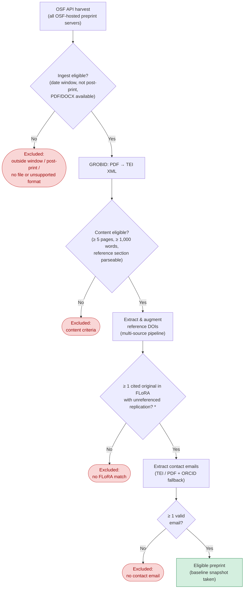
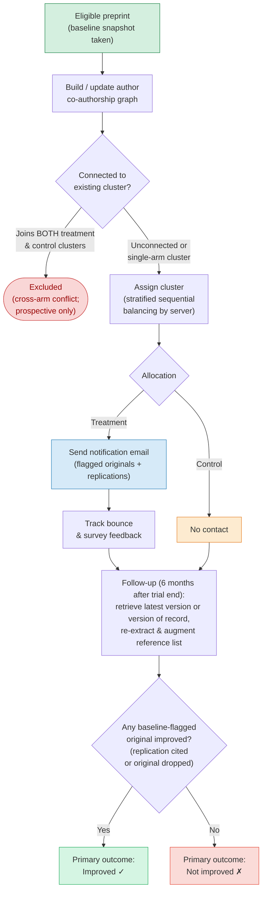

# FLoRA-Notify: Preprint Flow Through the Trial

## Part 1 — Eligibility Pipeline

\* FLoRA is updated regularly; preprints that initially have no FLoRA match are re-checked monthly as FLoRA expands, and enter the pipeline if a match is found.

## Part 2 — Randomisation, Intervention & Follow-up

## Key to protocol sections

| Flowchart stage | Protocol section |
|---|---|
| OSF API harvest | §4 Setting / §6.1 OSF Harvesting |
| Ingest eligible? | §5.1 Inclusion criteria (1–4) |
| GROBID & content eligibility | §6.2 PDF-to-References / §5.1 criteria (5–6) |
| DOI augmentation | §7.1 DOI Augmentation |
| FLoRA matching | §7.3 Matching to FLoRA / §5.1 criterion 8 |
| Email extraction | §6.3 Email Retrieval / §5.1 criterion 7 |
| Author graph & randomisation | §8 Randomisation and Allocation |
| Notification email | §9 Intervention |
| Control (no email) | §10 Control Condition |
| Follow-up & outcome | §11 Outcomes and Measurement |
